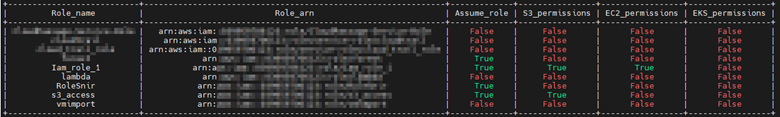
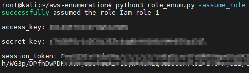
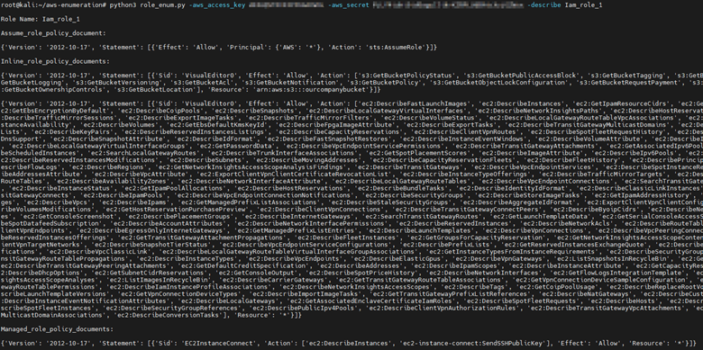

# role_enum

Script to enumerate IAM role in aws orgnaziation.
For full functionality, the script will require a user with the following AWS permissions:
  - iam:Get*
  - iam:List*
 
The script uses the following Amazon libaries: <br />
[Boto3](https://boto3.amazonaws.com/v1/documentation/api/latest/index.html) <br />
# Usage
- The script supports python3 
- Installing:  ``` pip install -r requierments.txt  ```

 *IAM role enumeration:*
 ``` python3 role_enum.py -aws_access_key <aws_access_key> -aws_secret <aws secret access key>  -enum_roles ``` 
 <br />
 <br />

 *Assuming IAM role:*
 ``` python3 role_enum.py -aws_access_key <aws_access_key> -aws_secret <aws secret access key>  -assume_role <role arn> ```
  <br />
 <br />
 
 *Describing IAM role:*
 ``` python3 role_enum.py -aws_access_key <aws_access_key> -aws_secret <aws secret access key>  -describe <role name> ```
  <br />
 <br />
